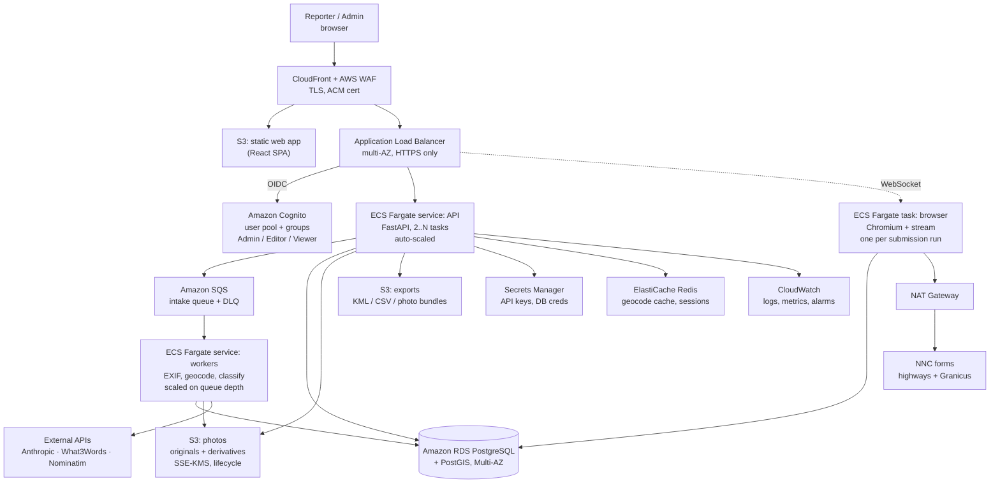

# NNC Reporter — AWS Cloud Migration
## Requirements Specification

**Version** 0.1 (draft for review) · **Date** 23 August 2026 · **Author** Alexander Lock
**Baseline** `nnc-reporter` local application (FastAPI + Playwright + SQLite), read on 23 Aug 2026
**Target** Multi-user, authenticated, load-balanced web application on AWS (eu-west-2, London)

---

## 1. Purpose and scope

### 1.1 Purpose

The NNC Reporter currently runs on one Windows PC, for one person, from a synced local folder.
It takes geotagged photographs of street faults, works out where they are, categorises them,
prefills North Northamptonshire Council's own reporting forms, captures the reference numbers
and exports a KML layer for Google My Maps.

This document specifies the requirements to move that capability to AWS as a hosted,
multi-user web application with authenticated role-based access and horizontal scaling,
**without losing any behaviour that exists today**.

### 1.2 Scope

**In scope**

- Every function of the current application (inventoried in §2), preserved or improved.
- A hosted web front end reachable over the public internet with TLS.
- Secure sign-in with three profiles: **Admin**, **Editor**, **Viewer**.
- Multi-user data separation: one person's reports are never mixed with another's.
- Horizontal scaling and load balancing across application instances.
- Migration of existing SQLite reports and stored photographs.
- UK GDPR compliance for photographs and reporter personal data.

**Out of scope (this phase)**

- A native mobile application (a mobile-responsive web UI is in scope; a packaged app is not).
- Replacing Google My Maps with an in-app map layer (see OPT-3, deferred).
- Automated submission without human confirmation — explicitly excluded, see §4.
- Any integration with council back-office systems beyond their public web forms.

### 1.3 How to read this

Requirements are numbered and prioritised **MoSCoW**: **M** must have, **S** should have,
**C** could have, **W** won't have this phase. Anything marked **[BASELINE]** is behaviour
that already works locally and must not regress.

---

## 2. Feature baseline — what the tool does today

This is the inventory the migration must preserve. Every item was read from the source, not assumed.

### 2.1 Photo intake (`nncr/photos.py`, `app.py:process_file`)

| # | Behaviour |
|---|---|
| B-01 | Drag-and-drop batch upload of photographs |
| B-02 | Accepted formats: `.jpg .jpeg .png .heic .heif .tif .tiff .webp`; iPhone HEIC read directly and converted to JPEG |
| B-03 | EXIF GPS latitude/longitude and capture timestamp extracted |
| B-04 | Photos with no GPS are skipped, with the reason shown to the user |
| B-05 | SHA-256 content hash used to reject the same photograph twice |
| B-06 | Thumbnail generated for the review grid |
| B-07 | Coordinates outside North Northamptonshire raise a warning, not a rejection |
| B-08 | Photos over 10 MB are downscaled to 3000 px on the longest edge and re-encoded before upload (council rejects >15 MB); EXIF rotation applied first; result cached; **the original file is never modified** |

### 2.2 Location enrichment (`nncr/geo.py`)

| # | Behaviour |
|---|---|
| B-09 | Reverse geocoding via OpenStreetMap Nominatim → street, locality, postcode |
| B-10 | What3Words three-word address via the W3W API (optional — degrades to street + postcode + coordinates if no key) |
| B-11 | Both lookups cached on disk (`geo_cache.json`) with Nominatim rate limiting |
| B-12 | Where a spot has no street of its own, the nearest road is used and the user warned |
| B-13 | Park proximity check (default 5 m radius) to answer the bins form's "is it in a park?" question |

### 2.3 Classification and drafting (`nncr/classify.py`, `nncr/categories.py`)

| # | Behaviour |
|---|---|
| B-14 | Photo sent to the Anthropic API (downscaled to 1400 px) which returns category, confidence, title, description, severity, reviewer notes |
| B-15 | Category must be copied verbatim from the live NNC list — the model may return blank rather than guess |
| B-16 | The 69 live NNC categories are bundled as an offline fallback (plus one synthetic `Litter or dog waste bin` entry that routes to the bins form), refreshable from the highways site’s own AJAX endpoint |
| B-17 | Bin reports additionally return `bin_type` (litter / dog waste) and `bin_issues` (needs emptying / damaged / missing / graffiti / other) |
| B-18 | Model is instructed never to describe people, faces, number plates or house numbers, and to flag them in notes for cropping |
| B-19 | Whole feature is optional: with no API key the user picks categories manually and everything else still works |

### 2.4 Review queue and warnings (`app.py`, `nncr/store.py`)

| # | Behaviour |
|---|---|
| B-20 | Tabs: **To submit**, **Submitted**, **On the map**, **Completed** |
| B-21 | Every field editable before submission; new photos arrive pre-ticked |
| B-22 | Warnings surfaced per report: low AI confidence, outside the area, person or number plate visible, emergency category, no matching category |
| B-23 | Duplicate guard: same category already submitted within 25 m is flagged with distance and the earlier report id |
| B-24 | Emergency categories (flooding, fallen trees, unsafe bridges, all signals out) are flagged with the council's phone numbers rather than queued |
| B-25 | **Split**: one bin with two problems becomes two reports, because the council form takes one at a time |
| B-26 | Delete one report or clear the queue; submitted history is retained unless explicitly included |
| B-27 | Live log panel, per report and per batch |

### 2.5 Routing (`nncr/routing.py`)

| # | Behaviour |
|---|---|
| B-28 | Three destinations: FixMyStreet highways site, Granicus fly-tipping form, Granicus litter/dog-bin form |
| B-29 | Fly-tipping is **forced** to the Granicus form — the highways site lists the category but refuses it. Not configurable, by design |
| B-30 | Litter/dog waste bins forced to the bins form, recognised by category *or* by description wording |
| B-31 | Deliberate exclusions: grit bins (highways), wheelie/recycling/household bins (refuse) |
| B-32 | Routing enforced in four places: on intake, on category change, on application start (correcting older queue entries), and immediately before each form is opened |

### 2.6 Form prefill and submission (`nncr/submit.py`, `selectors.json`)

| # | Behaviour |
|---|---|
| B-33 | Playwright drives a **visible** Chromium, one tab per report, each stopped at its Submit button |
| B-34 | **The tool never presses Submit.** The human reads each form and submits it, in any order |
| B-35 | Highways and fly-tipping reports can be mixed in one run |
| B-36 | Reference numbers captured as each submission completes — highways report id, or the `FLY…` reference read from inside the fly-tipping form's confirmation iframe |
| B-37 | If a confirmation appears with no reference, the report is still marked submitted and the reference can be pasted in manually |
| B-38 | Optional sign-in to the highways account so reports land under "My reports" and skip email confirmation; session persisted in a Chromium profile outside OneDrive |
| B-39 | Only one automation browser at a time; stale Chromium lock files cleared automatically |
| B-40 | **Asset picking**: tree, street light and bin categories require an asset pin off the council's map — the nearest is chosen within 60 m (`asset_max_metres`), otherwise it stops and asks the human |
| B-41 | **Pothole road snapping**: when the site rejects a footway/verge pin, road lines within 30 m (`road_max_metres`) are ranked and tried — nearest point plus 10 m along — re-checking acceptance each time, **maximum two moves** (`road_max_tries`). The photo's own coordinates are never altered; only the council's pin moves |
| B-42 | Fly-tipping five-step wizard walked end to end: agree, your details, nearest street, photo, fly-tipping detail; postcode address search; W3W box gets only the three words; type-of-fly-tipping matched to the dropdown's actual options by keyword, falling back to the model; 400-character caps respected |
| B-43 | Form steps recognised by the fields present, not by position; validation messages stop the run and are repeated verbatim |
| B-44 | Dead-end detection: if a category shows a "use the other form" notice, the report is switched to the correct form for the next run |
| B-45 | All selectors externalised to `selectors.json` as ordered candidate lists, editable when the council redesigns a form; `run-inspect.bat` dumps live field ids |

### 2.7 Export and mapping (`nncr/kml.py`)

| # | Behaviour |
|---|---|
| B-46 | KML written as a **complete snapshot** (Google My Maps has no write API and import replaces, so deltas are unsafe) |
| B-47 | CSV written alongside |
| B-48 | Pins colour-coded by broad type: fly-tipping, pothole, drain, vegetation, lighting, sign, other |
| B-49 | Each pin carries category, status, reference, date, street, What3Words and description |
| B-50 | Published photo URL scraped from the council's report page so pins display their photo on import |
| B-51 | Photo copies exported as `<id>-<category>-<street>.jpg` for pins with no published URL |
| B-52 | **List ref, street & description** — plain one-line-per-report text with a Copy button, for casework notes and councillor emails |
| B-53 | Lifecycle `new → ready/awaiting → submitted → mapped → completed`; "completed" means a later export replaced the file, kept as history so re-reporting is still warned about; re-exporting a completed report brings it back |

### 2.8 Profiles and configuration (`nncr/config.py`)

| # | Behaviour |
|---|---|
| B-54 | Multiple reporter profiles already exist locally — each has its own name, logins, report database, photo folder and map file |
| B-55 | Active profile persisted; profiles created, edited, switched and deleted through the API |
| B-56 | Key precedence: environment variables → `%USERPROFILE%\.nnc-reporter\keys.json` → `config.json`; `move-keys-out.bat` lifts secrets out of the synced folder |
| B-57 | Placeholder keys stripped so features degrade instead of erroring |
| B-58 | Self-checks: `check-keys.bat` (live API reachability), `selfcheck.py` (offline unit tests), `checkcode.py` (undefined-name scan) |

---

## 3. The one genuinely hard problem

Everything in §2 moves to AWS straightforwardly **except §2.6**. The submission engine is a
*visible* browser that a human watches and clicks Submit in. That is a deliberate design
decision (B-34) and it is the right one — bulk-firing unchecked reports at a council produces
wrong categories, duplicate reports, wasted crew visits and rate-limited accounts.

A stateless, load-balanced web tier cannot open a browser window on the user's desk. Three
options resolve this; **one must be chosen before build starts**, because the architecture
below differs materially by choice.

### Option A — Streamed remote browser *(recommended)*

Each submission run launches a short-lived **ECS Fargate task** running Chromium plus a
streaming server (noVNC/WebSocket, or Amazon DCV). The user's web session attaches to it
through the load balancer and sees the same tabs, in the same order, stopped at the same
Submit buttons — and clicks Submit themselves, in the browser stream.

- **Preserves** B-33 to B-45 exactly, including the human-in-the-loop principle.
- Session affinity handled by ALB target-group stickiness plus a WebSocket route.
- Fargate task per run, torn down after; cost is per-run, not per-hour.
- **Cost**: highest of the three. **Complexity**: highest. **Fidelity**: complete.

### Option B — Hybrid: cloud brain, local agent

Intake, enrichment, classification, queue, references and export all run in AWS. A small
signed local agent (essentially today's `submit.py` plus a poller) runs on the reporter's own
PC, pulls its assigned queue over an authenticated API, opens the browser locally exactly as
now, and posts references back.

- **Preserves** everything, with no streaming stack to build.
- Keeps the council-facing traffic on a residential IP, which is closer to how the forms
  expect to be used.
- **Cost**: lowest. **Complexity**: moderate (agent distribution, updates, signing).
- **Trade-off**: not "fully in the cloud" — each reporter still installs something.

### Option C — Server-side submission with in-app approval

The user approves each prefilled report in the web UI; a headless Fargate worker then presses
Submit on their behalf.

- **Changes the design principle.** Approval-from-a-summary is weaker review than
  approval-of-the-actual-form.
- Raises two real risks: bot-detection/rate-limiting on the council's forms from a fixed AWS
  egress IP, and submitting on behalf of a named resident from a datacentre.
- Should only be chosen with the council's knowledge.

> **Assumption carried through §5–§11: Option A.** Requirements that differ under B or C are
> flagged inline. Confirm this before the build begins.

---

## 4. Target architecture (AWS eu-west-2, London)

### 4.1 Service selection and rationale

| Layer | Service | Why |
|---|---|---|
| Edge | CloudFront + WAF + ACM | TLS termination, static asset caching, rate limiting, IP allow-listing if wanted |
| Load balancing | Application Load Balancer, 2+ AZs | HTTP/WebSocket aware, health checks, sticky sessions for browser streams |
| Web app | S3 static site behind CloudFront | The SPA is static; no compute needed to serve it |
| API | ECS Fargate (FastAPI) | Same Python stack as today; no servers to patch; scales on CPU and request count |
| Async work | SQS + Fargate workers | EXIF, geocoding and classification are slow and bursty — a 40-photo drop must not block the UI |
| Browser runs | Fargate task per run | Chromium needs ~2 vCPU / 4 GB; isolating it stops one run destabilising the API tier |
| Database | RDS PostgreSQL, Multi-AZ, PostGIS | SQLite cannot be shared across tasks; PostGIS makes the 25 m duplicate check (B-23), 60 m asset radius (B-40) and 30 m road search (B-41) indexed queries rather than full scans |
| Object store | S3, SSE-KMS | Photographs are large (10–18 MB originals observed) and must not live on task storage |
| Cache | ElastiCache Redis | Replaces `geo_cache.json` (B-11) with a shared cache; also holds Nominatim rate-limit tokens across tasks |
| Identity | Amazon Cognito user pool | Hosted sign-in, MFA, groups map to Admin/Editor/Viewer, JWTs the API validates |
| Secrets | Secrets Manager + KMS | Replaces `config.json` keys and `keys.json` (B-56) with rotation and audit |
| IaC | AWS CDK (TypeScript) or Terraform | Reproducible dev/prod, reviewable changes |
| CI/CD | GitHub Actions → ECR → ECS rolling deploy | Build, test (`selfcheck.py`, `checkcode.py`), push, deploy |

### 4.2 Network

- One VPC, three AZs. Public subnets: ALB and NAT Gateways only.
- Private subnets: Fargate tasks. Isolated subnets: RDS and ElastiCache.
- VPC endpoints for S3, ECR, Secrets Manager and CloudWatch Logs to cut NAT charges.
- Egress to council sites and third-party APIs via NAT Gateway with **static Elastic IPs**, so
  the council can allow-list them if the traffic volume ever prompts a conversation.

---

## 5. Functional requirements

### 5.1 Intake

| ID | Pri | Requirement |
|---|---|---|
| FR-01 | M | **[BASELINE B-01/02]** Users can upload a batch of photographs through the browser, drag-and-drop or file picker, in all formats supported today including HEIC. |
| FR-02 | M | Uploads go **directly to S3 via pre-signed POST**, not through the API tier — an 18 MB original must not traverse the application container. |
| FR-03 | M | **[B-03/04]** EXIF GPS and timestamp are extracted server-side; a photo without GPS is rejected with the reason shown, never silently dropped. |
| FR-04 | M | **[B-05]** SHA-256 content hash prevents the same photograph entering the queue twice, **scoped to the owning user**. |
| FR-05 | M | **[B-08]** Photos over 10 MB are downscaled to 3000 px longest edge, rotation applied first, derivative cached in S3; the original object is never overwritten. |
| FR-06 | M | **[B-06]** A thumbnail derivative is generated and served through CloudFront. |
| FR-07 | M | **[B-07]** Coordinates outside North Northamptonshire produce a warning, not a rejection. |
| FR-08 | M | Intake beyond the S3 upload is asynchronous via SQS; the UI shows per-photo progress and the user may navigate away and return. |
| FR-09 | S | Mobile upload: the responsive UI accepts photos straight from a phone's camera roll with EXIF intact. |
| FR-10 | C | Resumable/multipart upload for batches over 20 photos on poor connections. |

### 5.2 Enrichment

| ID | Pri | Requirement |
|---|---|---|
| FR-11 | M | **[B-09]** Reverse geocoding via Nominatim → street, locality, postcode. |
| FR-12 | M | **[B-10]** What3Words lookup, degrading cleanly to street + postcode + coordinates when unavailable. |
| FR-13 | M | **[B-11]** Results cached in ElastiCache with a shared, distributed Nominatim rate limiter — critical, because N scaled workers must not each hit Nominatim at the single-client rate. |
| FR-14 | M | **[B-12]** Where no street exists at the point, the nearest road is used and the user is warned. |
| FR-15 | M | **[B-13]** Park proximity check (configurable radius, default 5 m) for the bins form. |
| FR-16 | S | Nominatim usage reviewed against its acceptable-use policy at multi-user volume; a paid geocoder (or self-hosted Nominatim on ECS) selected before daily lookups exceed the free tier's fair use. |

### 5.3 Classification

| ID | Pri | Requirement |
|---|---|---|
| FR-17 | M | **[B-14/15]** Photo classified by the Anthropic API into a verbatim NNC category with confidence, title, description, severity and reviewer notes. |
| FR-18 | M | **[B-16]** The live category list is refreshable from the highways site and cached in the database; the bundled 69-category list remains the offline fallback. |
| FR-19 | M | **[B-17]** Bin type and bin issues returned and normalised, including the "model described two problems but listed one" correction from the description text. |
| FR-20 | M | **[B-18]** The classifier must continue to refuse to describe people, faces, number plates or house numbers, and must flag their presence for cropping. |
| FR-21 | M | **[B-19]** With classification disabled or unavailable, the user picks the category manually and every other function still works. |
| FR-22 | M | The Anthropic API key is held in Secrets Manager, **never** exposed to the browser, and cost is attributed per user for chargeback. |
| FR-23 | S | Per-user and per-organisation monthly classification spend caps with a warning at 80%. |

### 5.4 Review queue

| ID | Pri | Requirement |
|---|---|---|
| FR-24 | M | **[B-20]** Four views retained: To submit, Submitted, On the map, Completed. |
| FR-25 | M | **[B-21]** All report fields editable pre-submission; new photos arrive selected. |
| FR-26 | M | **[B-22]** All existing warnings preserved and shown per report. |
| FR-27 | M | **[B-23]** Duplicate guard: same category within 25 m of an already-submitted report, implemented as an indexed PostGIS query. |
| FR-28 | M | **[B-23+]** The duplicate guard must check across **all users in the same organisation**, not just the current user — two volunteers photographing the same pothole is the common case, and is exactly what the local tool cannot catch today. |
| FR-29 | M | **[B-24]** Emergency categories flagged with NNC's phone numbers (0300 126 3000; 01604 651074 out of hours) and never queued for submission. |
| FR-30 | M | **[B-25]** Split: one bin with multiple issues becomes multiple reports with correct per-issue wording. |
| FR-31 | M | **[B-26]** Delete a report or clear the queue; submitted history retained unless explicitly included, and only Admins may include it. |
| FR-32 | M | **[B-27]** Live log streamed to the UI per report and per batch (WebSocket or SSE), persisted for later inspection. |
| FR-33 | S | Filter and search the queue by street, category, status, date and reporter. |
| FR-34 | C | Bulk category change across selected reports. |

### 5.5 Routing

| ID | Pri | Requirement |
|---|---|---|
| FR-35 | M | **[B-28..B-32]** The routing rules move unchanged, including that fly-tipping and bins are forced, not configurable, and that the rule is re-applied on intake, on category change, on service start and immediately before each form opens. |
| FR-36 | M | **[B-31]** Grit bins and household/recycling bins remain excluded. |
| FR-37 | M | **[B-44]** Dead-end detection continues to reroute a report when a council form displays a "use the other form" notice. |

### 5.6 Submission *(Option A)*

| ID | Pri | Requirement |
|---|---|---|
| FR-38 | M | **[B-33/34] The system must never press Submit.** Prefill stops at the Submit button and a human presses it. This is a hard constraint, not a default. |
| FR-39 | M | A submission run launches a dedicated Fargate browser task, one tab per selected report, and streams it to the initiating user's browser over an authenticated WebSocket. |
| FR-40 | M | **[B-35]** Highways and fly-tipping reports may be mixed in one run. |
| FR-41 | M | **[B-36/37]** Reference numbers captured automatically, including the `FLY…` reference from inside the confirmation iframe; manual paste remains available when no reference appears. |
| FR-42 | M | **[B-38]** Per-user highways account sign-in, with credentials in Secrets Manager under the user's own path and the session state persisted per user (S3 or EFS), never shared between users. |
| FR-43 | M | **[B-39]** One active browser run per user at a time, enforced by a database lock rather than a file lock; a second attempt returns a clear message. |
| FR-44 | M | **[B-40]** Asset picking within 60 m, stopping and asking the human beyond that. |
| FR-45 | M | **[B-41]** Pothole road snapping within 30 m, maximum two moves, photo coordinates never altered. |
| FR-46 | M | **[B-42]** The five-step fly-tipping wizard walked in full, with the reporter's own address taken from their profile. |
| FR-47 | M | **[B-43]** Steps recognised by fields present; validation messages stop the run and are repeated verbatim. |
| FR-48 | M | **[B-45]** `selectors.json` becomes a versioned, Admin-editable configuration record in the database, with a form-inspection mode that dumps live field ids — a council redesign must be fixable without a redeploy. |
| FR-49 | M | The browser task idles no longer than a configurable timeout (default 15 minutes, matching today's `wait_for_submit_seconds`) and is then torn down, with any unsubmitted reports returned to the queue. |
| FR-50 | S | If the user's connection drops mid-run, they can reattach to the same browser task within the timeout. |

### 5.7 Export and mapping

| ID | Pri | Requirement |
|---|---|---|
| FR-51 | M | **[B-46/47]** KML and CSV written as a complete snapshot, downloadable from the UI via a pre-signed S3 URL. |
| FR-52 | M | **[B-48/49]** Pin colours and pin metadata unchanged. |
| FR-53 | M | **[B-50]** Published photo URL scraped from the council report page so pins display photos on import. |
| FR-54 | M | **[B-51]** Photo bundle exported as a ZIP with the same `<id>-<category>-<street>.jpg` naming. |
| FR-55 | M | **[B-52]** "List ref, street & description" plain-text output with copy-to-clipboard, on the Submitted, On the map and Completed views. |
| FR-56 | M | **[B-53]** The `new → ready → submitted → mapped → completed` lifecycle preserved, including that completed reports still trigger duplicate warnings and can be re-exported. |
| FR-57 | S | Per-user and per-organisation KML layers, so each reporter can maintain their own My Map while an Admin can export the combined layer. |
| FR-58 | C | A read-only in-app map view (MapLibre) of all reports, so Viewers can see coverage without touching Google My Maps. |

### 5.8 Administration

| ID | Pri | Requirement |
|---|---|---|
| FR-59 | M | Admins manage users: invite, assign role, suspend, remove. |
| FR-60 | M | **[B-54/55]** The local "profiles" concept becomes real user accounts; each user's reports, photos, exports and council credentials are isolated. |
| FR-61 | M | Admins manage organisation-level settings: category refresh, selector configuration, radii (`asset_max_metres`, `road_max_metres`, `road_max_tries`, park radius), classification on/off and model. |
| FR-62 | M | **[B-58]** Health endpoint and self-check equivalents: live API reachability check, offline unit tests in CI, and a startup configuration validation that fails the deployment rather than degrading silently. |
| FR-63 | S | Admin dashboard: reports by status, by category, by reporter, by month; submission success rate; classification spend. |

---

## 6. Identity, authentication and authorisation

### 6.1 Roles

| Role | Intended holder | Summary |
|---|---|---|
| **Admin** | Whoever runs the operation | Everything an Editor can do, plus user management, organisation settings, selector and category maintenance, access to all reports, and the only role that can delete submitted history |
| **Editor** | An active reporter / volunteer | Upload, enrich, edit, route, run submissions, capture references, export their own map layer. Sees their own reports plus (read-only) the organisation's submitted reports, so duplicates are visible |
| **Viewer** | Councillor, ward member, casework colleague | Read-only. Sees submitted reports, references, streets, descriptions and map exports. Cannot upload, edit, submit or export photos |

### 6.2 Permission matrix

| Capability | Admin | Editor | Viewer |
|---|:--:|:--:|:--:|
| Upload photos | ✅ | ✅ | ❌ |
| Edit own draft reports | ✅ | ✅ | ❌ |
| Edit another user's draft | ✅ | ❌ | ❌ |
| Run a submission (prefill browser) | ✅ | ✅ | ❌ |
| Enter/correct a reference | ✅ | ✅ | ❌ |
| View own reports | ✅ | ✅ | n/a |
| View organisation's submitted reports | ✅ | ✅ (read-only) | ✅ (read-only) |
| View original photographs | ✅ | own only | ❌ (thumbnails only) |
| Export KML/CSV (own) | ✅ | ✅ | ❌ |
| Export KML/CSV (organisation) | ✅ | ❌ | ⬜ configurable |
| "List ref, street & description" text | ✅ | ✅ | ✅ |
| Delete a draft report | ✅ | own only | ❌ |
| Delete submitted history | ✅ | ❌ | ❌ |
| Manage users and roles | ✅ | ❌ | ❌ |
| Edit selectors, radii, categories | ✅ | ❌ | ❌ |
| View audit log | ✅ | own actions | ❌ |

### 6.3 Requirements

| ID | Pri | Requirement |
|---|---|---|
| AUTH-01 | M | Authentication via Amazon Cognito user pool with hosted UI; no passwords stored or handled by application code. |
| AUTH-02 | M | Password policy: minimum 12 characters, breach-list checked, no forced rotation (NCSC guidance). |
| AUTH-03 | M | **MFA required for Admin**, available and encouraged for all roles (TOTP; SMS not used). |
| AUTH-04 | M | Roles implemented as Cognito **groups** mapped to the three profiles; group membership is the single source of truth. |
| AUTH-05 | M | API authorises every request server-side against the JWT's group claim. Front-end role checks are for usability only and are never trusted. |
| AUTH-06 | M | Row-level ownership enforced in the data layer: every query is scoped by `user_id` and `org_id`; no endpoint returns another user's draft. |
| AUTH-07 | M | Access tokens expire in 60 minutes; refresh tokens in 30 days; refresh tokens revoked on sign-out, role change or suspension. |
| AUTH-08 | M | Account lockout and adaptive risk detection enabled (Cognito advanced security). |
| AUTH-09 | M | Self-registration **disabled**. Users exist only by Admin invitation. |
| AUTH-10 | M | Council-site credentials (`highways_login`) stored per user in Secrets Manager, encrypted with KMS, write-only from the UI — never returned to the browser after being set. |
| AUTH-11 | S | Sign-in with Google/Microsoft as a federated identity provider, so volunteers do not manage another password. |
| AUTH-12 | S | Session and sign-in events written to the audit log with IP and user agent. |
| AUTH-13 | C | Ward-level scoping for Viewers, so a member sees only their own ward's reports. |

---

## 7. Security and data protection

| ID | Pri | Requirement |
|---|---|---|
| SEC-01 | M | HTTPS only; TLS 1.2 minimum, 1.3 preferred; HTTP redirected; HSTS set at CloudFront. |
| SEC-02 | M | All data encrypted at rest: RDS, S3 (SSE-KMS), ElastiCache, EBS, CloudWatch Logs. Customer-managed KMS keys with rotation. |
| SEC-03 | M | S3 buckets: Block Public Access on, no public objects. Photographs served **only** through time-limited pre-signed URLs or CloudFront signed URLs. |
| SEC-04 | M | No secret in source control, environment files or container images. Secrets Manager only, injected at task start. |
| SEC-05 | M | Least-privilege IAM task roles: the API task cannot read another task's secrets; the browser task has no write access to the photo bucket. |
| SEC-06 | M | AWS WAF on CloudFront: managed common rule set, rate limiting per IP, and a size cap on upload requests. |
| SEC-07 | M | GuardDuty, AWS Config and CloudTrail enabled; CloudTrail logs to a separate, versioned, object-locked bucket. |
| SEC-08 | M | Dependency and container image scanning in CI (ECR scan on push); build fails on critical CVEs. |
| SEC-09 | M | Uploaded files validated by content type and magic bytes, not extension; images re-encoded before any further processing, which also strips embedded payloads. |
| SEC-10 | M | The browser task runs in a private subnet with no inbound access except the authenticated stream through the ALB, and is destroyed after each run. |
| SEC-11 | S | Annual penetration test, or at minimum an automated OWASP ZAP baseline scan per release. |

### 7.1 UK GDPR and privacy

This matters more than it would for a generic app: the photographs are of public streets and
may capture **people, faces, number plates and house numbers**, and the reporter's own **home
address and phone number** are required by the fly-tipping form.

| ID | Pri | Requirement |
|---|---|---|
| DP-01 | M | A Data Protection Impact Assessment is completed before go-live. Photographs of the public highway that may contain identifiable individuals and vehicles constitute personal data. |
| DP-02 | M | **[B-18]** The classifier's refusal to describe people, faces, plates and house numbers is retained, and its flag must be surfaced prominently in the review UI. |
| DP-03 | M | An in-app **crop/redact tool** so a flagged photograph can be corrected before it is sent to the council — today the user must leave the tool to do this. |
| DP-04 | M | Retention policy defined and enforced by S3 lifecycle and a scheduled job: original photographs deleted after N months once the report is completed (proposed **12 months**); report metadata and references retained longer as casework history. |
| DP-05 | M | Reporter personal data (name, email, phone, home address) held only against their own account, visible only to them and to Admins, and deleted on account deletion. |
| DP-06 | M | Data subject access and erasure: an Admin can export or delete everything held about one user within the statutory month. |
| DP-07 | M | All personal data stored in **eu-west-2**. No replication outside the UK. Any third-party processor (Anthropic, What3Words) named in the privacy notice with its own DPA in place. |
| DP-08 | M | Privacy notice published and linked from sign-in, covering what is collected, why, the lawful basis, retention and third parties. |
| DP-09 | S | Automatic face and number-plate blurring on upload, with the unblurred original retained only until the report is submitted. |
| DP-10 | S | Audit log of every access to an original photograph. |

---

## 8. Scalability and load balancing

The current tool is single-user and single-threaded. These requirements define what "balanced"
means concretely rather than as an aspiration.

### 8.1 Assumed load *(to be confirmed — see §14)*

| Dimension | Assumption |
|---|---|
| Named users | 10–50, growing to 200 |
| Concurrent active users | 5–20, peaking after a weekend canvassing session |
| Photos per upload batch | 5–60 |
| Photos per month | 500–5,000 |
| Concurrent submission runs | 1–5 |
| Read traffic (Viewers) | Low and bursty, spiking around council meetings |

The load shape is **bursty and long-tailed**: nothing for three days, then forty photographs at
once on a Sunday evening. That argues for queue-driven scaling rather than a fixed fleet.

### 8.2 Requirements

| ID | Pri | Requirement |
|---|---|---|
| SCL-01 | M | An Application Load Balancer distributes across **at least two Availability Zones**, with HTTP health checks on `/health` and unhealthy tasks drained and replaced automatically. |
| SCL-02 | M | The API runs as an ECS Fargate **service with a minimum of 2 tasks** across different AZs, so a single task or AZ failure is not an outage. |
| SCL-03 | M | API target tracking auto-scaling on **average CPU 60%** and **ALB requests-per-target**, scaling 2 → 10 tasks, scale-out cooldown 60 s, scale-in 300 s. |
| SCL-04 | M | The API tier is **stateless**: no report data, photo, session or cache on task storage. Any task can serve any request. |
| SCL-05 | M | Photo processing (EXIF, resize, geocode, classify) runs in a separate worker service scaled on **SQS `ApproximateNumberOfMessagesVisible`** via target tracking — a 60-photo drop scales workers up, then back to zero-or-one when the queue drains. |
| SCL-06 | M | The intake queue has a dead-letter queue after 3 attempts, with an alarm on DLQ depth; a poisoned photo never blocks the batch. |
| SCL-07 | M | Browser submission tasks are **not** part of a scaled service — one ephemeral task per run, capped by a per-organisation concurrency limit (default 5) to protect the council's forms from concurrent load. |
| SCL-08 | M | ALB target-group **stickiness** enabled for the browser-stream target group so a streamed session stays on its task; the API target group is deliberately non-sticky. |
| SCL-09 | M | RDS Multi-AZ with automatic failover. Connection pooling (RDS Proxy or PgBouncer) so scaling to 10 API tasks does not exhaust database connections. |
| SCL-10 | M | Rate limiting of outbound third-party calls is **global, not per-task** — a shared Redis token bucket for Nominatim and What3Words. Scaling out must not multiply the request rate to someone else's free API. |
| SCL-11 | S | RDS read replica for the Admin dashboard and Viewer queries, so reporting load does not touch the write path. |
| SCL-12 | S | Load test before go-live: 20 concurrent users, 3 concurrent 60-photo batches, 5 concurrent browser runs, confirming the targets in §9. |
| SCL-13 | C | Scheduled scale-down to a single API task overnight to reduce cost. |

### 8.3 Performance targets

| Metric | Target |
|---|---|
| Page load (cached, CloudFront) | < 1.5 s p95 |
| API read response | < 300 ms p95 |
| Photo upload accepted (pre-signed, 5 MB) | < 5 s p95 |
| Photo fully enriched and classified | < 45 s p95 from upload |
| 40-photo batch fully processed | < 6 minutes |
| Browser run attached and first tab prefilled | < 60 s |
| Availability | 99.5% monthly (business hours), excluding council-site outages |

---

## 9. Reliability and observability

| ID | Pri | Requirement |
|---|---|---|
| REL-01 | M | RDS automated backups, 30-day retention, point-in-time recovery, plus a monthly snapshot retained 12 months. |
| REL-02 | M | S3 versioning on the photo and export buckets; cross-region replication is **not** used, to keep data in the UK. |
| REL-03 | M | Documented and **tested** restore procedure; RPO 24 hours, RTO 4 hours. |
| REL-04 | M | Graceful degradation, mirroring today's behaviour: no What3Words key → street and coordinates only; no Anthropic key → manual categorisation; Nominatim down → the report is still created and can be enriched later. |
| REL-05 | M | Idempotent workers — a redelivered SQS message must not create a duplicate report. |
| OBS-01 | M | Structured JSON logs to CloudWatch, correlated by request id and report id, retained 90 days. |
| OBS-02 | M | Alarms on: 5xx rate, unhealthy target count, DLQ depth, RDS CPU and free storage, classification spend, and browser tasks failing to start. |
| OBS-03 | M | Alerts to email and/or Slack via SNS. |
| OBS-04 | M | **Selector-failure alarm**: a rise in "could not find field" log lines is the earliest signal that the council has redesigned a form (the single most likely cause of breakage). It must page someone. |
| OBS-05 | S | X-Ray tracing across API → SQS → worker → external API. |
| OBS-06 | S | Business dashboard: reports submitted per week, references captured vs missing, average time from photo to submission. |

---

## 10. Data model and migration

### 10.1 Schema changes from SQLite

The existing `reports` table migrates broadly as-is, with these changes:

| Change | Reason |
|---|---|
| Add `user_id`, `org_id` (both indexed, not null) | Multi-tenancy and row-level scoping |
| `sha` unique constraint becomes **unique per user** | Two volunteers may legitimately hold the same photo |
| `photo_path`, `thumb_path` → `photo_key`, `thumb_key`, `upload_key` (S3 keys) | Object storage instead of local paths |
| Add `geom geography(Point,4326)` with a GiST index, populated from `lat`/`lon` | Makes B-23 / B-40 / B-41 indexed rather than a full table scan per photo |
| `bin_issues` TEXT-JSON → `jsonb` | Queryable |
| Add `created_by`, `updated_at`, `submitted_by` | Audit |
| New tables: `users`, `organisations`, `audit_log`, `selectors` (versioned), `categories`, `submission_runs` | Multi-user, admin-editable configuration, auditability |
| Keep: `status` lifecycle values and `DONE_STATUSES` semantics exactly | B-53 depends on them |

| ID | Pri | Requirement |
|---|---|---|
| DAT-01 | M | A one-off migration imports the existing `data/reports.db` — all reports, statuses, references, report URLs and photo URLs — assigned to the primary user's account. |
| DAT-02 | M | Existing photographs and thumbnails uploaded to S3 with keys rewritten in the database; the `_upload.jpg` derivatives migrated too, not regenerated. |
| DAT-03 | M | Existing local profiles (`data/profiles/*`) migrate to their own user accounts. |
| DAT-04 | M | The migration is **idempotent and reversible**, verified in a dev environment against a copy before it is run for real. The local folder is retained untouched as the rollback position for at least three months. |
| DAT-05 | M | Post-migration verification: report counts by status, reference counts and photo object counts reconciled against the source database, and the result recorded. |
| DAT-06 | S | `NNC_Reports.csv` and `NNC_Reports.kml` regenerated from the migrated data and diffed against the current files as an end-to-end check. |

---

## 11. Environments, delivery and operations

| ID | Pri | Requirement |
|---|---|---|
| OPS-01 | M | Two environments — **dev** and **prod** — in separate AWS accounts under an Organization, with SSO. |
| OPS-02 | M | All infrastructure defined as code (CDK or Terraform). No console-created production resources. |
| OPS-03 | M | CI runs `selfcheck.py`, `checkcode.py`, linting and dependency scanning on every pull request; prod deploys only from `main` after review. |
| OPS-04 | M | Rolling ECS deployments with health-check gating and automatic rollback on alarm. |
| OPS-05 | M | Database migrations version-controlled (Alembic) and applied as a pre-deploy task, never by application startup. |
| OPS-06 | M | AWS Budgets alert at 80% and 100% of the monthly budget; cost allocation tags per environment and component. |
| OPS-07 | S | A staging environment mirroring prod for load and selector testing against the council's real forms — using test data only and never submitting. |
| OPS-08 | S | Runbooks for the three likely incidents: council form redesign, third-party API outage, database failover. |

---

## 12. Indicative cost

> **These are order-of-magnitude figures for planning only.** AWS publishes regional rates as
> dynamic tables that could not be read programmatically for this document; validate every line
> in the **AWS Pricing Calculator** for eu-west-2 before committing to a budget.

| Component | Sizing assumption | Indicative £/month |
|---|---|---|
| ALB | 1 ALB, low LCU usage | 18–25 |
| ECS Fargate — API | 2 × 0.5 vCPU / 1 GB, always on | 25–35 |
| ECS Fargate — workers | Bursty, ~20 vCPU-hours/month | 5–15 |
| ECS Fargate — browser tasks | 2 vCPU / 4 GB, ~20 runs × 20 min | 5–15 |
| RDS PostgreSQL | db.t4g.small Multi-AZ, 20 GB gp3 | 55–75 |
| ElastiCache Redis | cache.t4g.micro | 12–18 |
| S3 | 100 GB photos + requests | 2–5 |
| CloudFront + WAF | Low traffic, WAF managed rules | 10–20 |
| NAT Gateway | 2 AZs + modest data | 55–70 |
| Cognito | Under 50 monthly active users | £0 (free tier) |
| Secrets Manager, KMS, CloudWatch, ECR | — | 10–20 |
| **AWS subtotal** | | **≈ £200–300** |
| Anthropic API | ~1,000 classifications/month | 5–20 |
| What3Words | Free tier likely sufficient | 0 |
| **Total** | | **≈ £205–320/month** |

**Meaningful reductions available**

- Drop to a single NAT Gateway (saves ~£30, costs AZ redundancy for egress) — reasonable for this workload.
- Single-AZ RDS in dev, Multi-AZ only in prod (saves ~£30).
- Choose **Option B (hybrid)** and the browser tasks, their NAT egress and much of the streaming complexity disappear; realistic total ≈ **£140–200/month**.
- Graviton (ARM) Fargate and RDS `t4g` instances are already assumed above.

---

## 13. Delivery plan

| Phase | Duration | Delivers | Exit criteria |
|---|---|---|---|
| **0 — Decisions** | 1 week | §3 option chosen; load assumptions confirmed; DPIA started; AWS accounts and SSO created | Architecture signed off |
| **1 — Foundations** | 2 weeks | VPC, ALB, RDS, S3, Cognito, CI/CD, IaC, `/health` behind TLS | "Hello world" deploys through the pipeline; Admin can sign in |
| **2 — Core pipeline** | 3 weeks | FR-01 to FR-23: upload, EXIF, geocode, W3W, classify, queue, SQS workers | A photo dropped in the browser appears fully enriched in the queue |
| **3 — Review and routing** | 2 weeks | FR-24 to FR-37: four views, warnings, duplicate guard, split, routing rules | Feature parity with §2.4 and §2.5, verified against the local tool on the same photos |
| **4 — Submission** | 3–4 weeks | FR-38 to FR-50: browser tasks, streaming, references, asset picking, road snapping, fly-tipping wizard | A real report is prefilled in the cloud and submitted by a human, reference captured |
| **5 — Export and admin** | 2 weeks | FR-51 to FR-63: KML/CSV, photo bundles, list output, user management, settings | KML imported into My Maps is identical in content to today's |
| **6 — Security and data** | 2 weeks | §7 controls, DPIA completed, retention job, redaction tool, audit log | DPIA signed; WAF, GuardDuty and alarms live |
| **7 — Migration and launch** | 1–2 weeks | DAT-01 to DAT-06, load test, runbooks, user onboarding | Counts reconciled; load test meets §8.3; local tool retired to read-only |

**Total: roughly 16–18 weeks** of part-time effort, or 8–10 weeks with dedicated development.

---

## 14. Open decisions

These block or materially change the build. Each needs an answer before Phase 1 ends.

| # | Decision | Why it matters |
|---|---|---|
| D-1 | **§3 Option A, B or C?** | Changes the architecture, the cost and roughly four weeks of the plan |
| D-2 | How many users, and are they one organisation or several branches? | Multi-tenancy depth; whether `org_id` needs to be a hard boundary or a soft one |
| D-3 | Do Viewers see photographs at all, or only descriptions and references? | Drives DP-03/DP-09 priority and the permission matrix |
| D-4 | Photo retention period | Proposed 12 months post-completion; needs a decision for the DPIA |
| D-5 | Who is the data controller — you personally, or the branch/organisation? | Determines who signs the DPIA and the privacy notice |
| D-6 | Does each user bring their own council account and API keys, or is there a shared organisation account? | Affects AUTH-10 and Anthropic cost attribution |
| D-7 | One shared Google My Map, or one per reporter? | FR-57 |
| D-8 | Is the council aware of and comfortable with the tool at multi-user volume? | Bears directly on D-1 and on rate limiting (SCL-07) |
| D-9 | Budget ceiling | Determines Multi-AZ, read replicas and NAT redundancy |
| D-10 | Nominatim at volume — accept fair-use limits, pay for a geocoder, or self-host? | FR-16; at 5,000 lookups/month this becomes real |

---

## 15. Assumptions

1. The application stays Python/FastAPI, so `nncr/*` modules port with modest change.
2. The council's forms remain publicly accessible without an API, and `selectors.json` remains the adaptation mechanism.
3. Google My Maps still has no write API, so KML export remains the mapping route.
4. All users are in the UK and eu-west-2 latency is acceptable.
5. No council back-office integration is available or planned.
6. Anthropic and What3Words remain available on commercial terms compatible with this use.

---

## 16. Traceability

Every baseline feature in §2 maps to at least one requirement in §5–§7:

| Baseline | Requirements |
|---|---|
| B-01…B-08 (intake) | FR-01…FR-07 |
| B-09…B-13 (enrichment) | FR-11…FR-15 |
| B-14…B-19 (classification) | FR-17…FR-21, DP-02 |
| B-20…B-27 (queue) | FR-24…FR-32 |
| B-28…B-32 (routing) | FR-35, FR-36 |
| B-33…B-45 (submission) | FR-38…FR-50 |
| B-46…B-53 (export) | FR-51…FR-56 |
| B-54…B-58 (profiles, config, checks) | FR-59…FR-62, AUTH-04…AUTH-06, AUTH-10, SEC-04, DAT-03 |

**No baseline feature is dropped.** Three are deliberately strengthened: the duplicate guard
becomes organisation-wide (FR-28), selector configuration becomes editable without a redeploy
(FR-48), and photo redaction moves inside the tool (DP-03).
